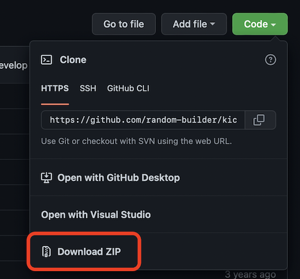

# Nuke Tracks KiCad Plugin

Maybe you've made a right mess of things and want to start over? Or maybe you're using the [auto router plugin](https://github.com/random-builder/kicad_freerouting-plugin) and want to make sure random junk isn't going to ruin things.

You could run the menu command to delete all non-locked tracks then refill the zones. Or you could push this 1 button which is just easier and faster.

This plugin will nuke all tracks that are not locked on the board<sup>*</sup> then automatically regenerates any zones. 

Have regrets? A single undo will put it back to how it was before the plugin ran.

\* *By not deleting locked tracks you can choose to keep anything you're happy with and have locked.*

## Installation

* Click the green "Code" button in the top right and select Download ZIP.
    
* Extract that zip file to somewhere you will remember.
* In the PCB design window select the menu item **Tools > External Plugins > Reveal Plugin Folder in Finder/Explorer**.
* Copy the extracted files into the plugin folder that you just opened.
* Close and re-open the PCB deign window.

You should see the nuke icon in the top menu bar.

or if you're the type to understand this 
```
cd [path to you kicad scripting folder]/plugins
git clone https://github.com/themaninthesuitcase/kicad_nuke_tracks_plugin.git
```

Icon by Lorc under CC BY 3.0
https://game-icons.net/1x1/lorc/mushroom-cloud.html
